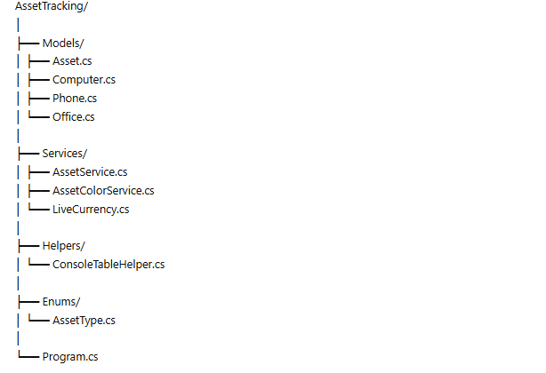
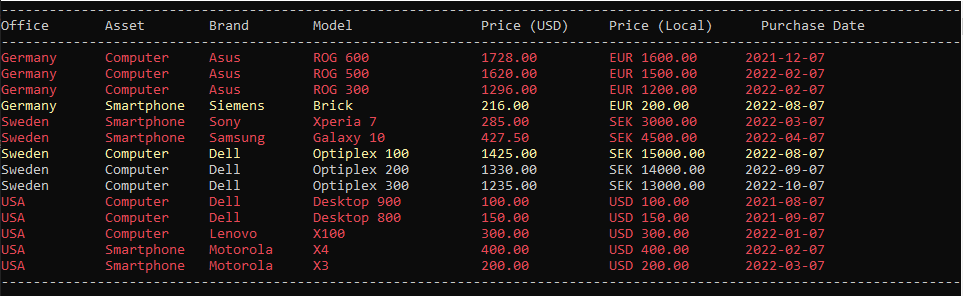

# Asset Tracking System

A clean and structured C# console application designed to track company assets across multiple offices worldwide.

## 🚀 Features

- Track assets across **multiple offices**
- Support for **different currencies per country**
- Automatic **currency conversion from USD**
- Assets sorted by:
  - Office
  - Purchase Date
- Visual status indicators:
  - 🔴 Red → Less than 3 months before 3 years
  - 🟡 Yellow → Less than 6 months before 3 years
- Clean and modular **OOP architecture**

---

## 📁 Project Structure

## 🖥️ Example Output

---

## 💻 Technologies

- C#
- .NET
- Object-Oriented Programming (OOP)
- LINQ

---

## 📌 How It Works

1. Assets are loaded into the system
2. Prices are stored in USD
3. Converted dynamically into local office currency
4. Sorted and displayed in console
5. Color-coded based on asset age

---

## ▶️ Run the Project

Clone the repository:

git clone https://github.com/osmanosmani/AssetTracking.git

---

## 🎯 Purpose

This project was built to practice:

- Clean architecture
- OOP principles
- Data handling and sorting
- Real-world business logic simulation

---

## 👤 Author

Osman Osmani  
Senior SEO & Web Specialist | .NET Developer

---

## ⭐ Notes

This is a learning project, but structured with real-world practices in mind.
